# 🚀 AI Mastery Roadmap 2026: Business AI · Azure AI · Agentic AI — Beginner to Expert (L100–L400)

> **Reading-first, build-ready** learning path from fundamentals to expert depth across **Business AI**, **Azure AI**, **AWS / GCP / NVIDIA AI**, and **Agentic AI** — with a dedicated **SAP Joule** track and **Microsoft Copilot** depth.

> 🆕 **May 2026 Update:** Frontier-model refresh (GPT-5.x, Claude 4.7, Gemini 3, Llama 4), Model Context Protocol (MCP) on Linux Foundation, **Microsoft Agent Framework** (AutoGen v0.4 + Semantic Kernel merger), Azure AI Foundry **Agent Service GA**, NVIDIA NIM/Blueprints, SAP Joule Studio GA, and four **multi-cloud certification ladders**.

**Maintained by:** [@amitlals](https://github.com/amitlals) · **Site:** [amitlal.github.io](https://amitlal.github.io)

---

## 🗺️ Table of Contents

1. [Why this roadmap](#-why-this-roadmap)
2. [What's New in 2026](#-whats-new-in-2026)
3. [The L100–L400 Pyramid](#-the-l100l400-learning-pyramid)
4. [Pick Your Track (4 audiences)](#-pick-your-track--4-audience-paths)
5. [L100 — Fundamentals & Business Context](#-l100--ai-fundamentals--business-context)
6. [L200 — Technical Implementation (Azure · AWS · GCP)](#-l200--technical-implementation--multi-cloud-ai)
7. [L300 — Advanced AI, Agents & MCP](#-l300--advanced-ai-agents--mcp)
8. [L400 — Expert Architecture, Strategy & Governance](#-l400--expert-architecture-strategy--governance)
9. [Multi-Cloud Certification Ladder](#-multi-cloud-certification-ladder)
10. [SAP Joule Track](#-sap-joule-track-new-for-2026)
11. [Frontier Models Reference (May 2026)](#-frontier-models-reference-may-2026)
12. [Top GitHub Repos & Sample Projects](#-top-github-repos--sample-projects)
13. [Recommended Learning Sequences](#-recommended-learning-sequences)
14. [Community & Contributing](#-community--contributing)
15. [License & Notes](#-license--notes)

---

## 🎯 Why this roadmap

A clean, no-fluff progression that tells you **what to learn, in what order**, using widely recognized content and standards — so you can move from **overview → implementation → agentic systems → leadership** without getting stuck choosing courses.

| Pillar | What you get |
|---|---|
| 📚 **Curated** | Only high-signal, industry-recognized materials — no listicle filler |
| 🎯 **Progressive** | A defensible L100 → L400 ladder with concrete checkpoints |
| 💼 **Business + Technical** | Strategy lanes for sellers/leaders, build lanes for engineers |
| ☁️ **Multi-cloud** | Azure-led, but with parallel **AWS · GCP · NVIDIA** cert ladders |
| 🤖 **Agentic-native** | MCP, Microsoft Agent Framework, LangGraph, CrewAI, Computer Use |
| 🆓 **Mixed pricing** | Free + paid options at every level — no paywalls assumed |

---

## 🆕 What's New in 2026

The AI landscape has shifted significantly since the December 2025 edition. Here's what changed and where to find it in this roadmap.

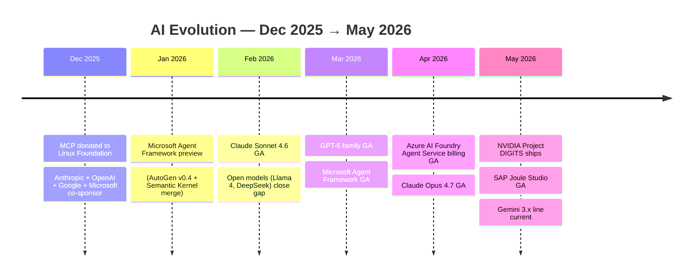

| Trend | What it means | Where to learn it |
|---|---|---|
| 🧩 **Model Context Protocol (MCP)** | Open standard for connecting LLMs to tools/data — adopted by all major vendors | [L300](#-l300--advanced-ai-agents--mcp) |
| 🎛️ **Microsoft Agent Framework** | AutoGen v0.4 + Semantic Kernel unified into one SDK | [L300](#-l300--advanced-ai-agents--mcp) |
| 🏭 **Azure AI Foundry Agent Service** | Hosted agents w/ memory, billing live, M365 Copilot integration | [L400](#-l400--expert-architecture-strategy--governance) |
| 🤖 **Frontier model leap** | GPT-5.x, Claude 4.7, Gemini 3, Llama 4 — multi-modal + reasoning by default | [Frontier Models](#-frontier-models-reference-may-2026) |
| 🖥️ **Computer Use agents** | Claude Computer Use, ChatGPT Agent Mode — agents drive the desktop | [L300](#-l300--advanced-ai-agents--mcp) |
| 🔍 **GraphRAG + Agentic RAG** | Knowledge graphs and agent-driven retrieval replacing naive vector RAG | [L300](#-l300--advanced-ai-agents--mcp) |
| 🟦 **SAP Joule Studio** | Low-code agent builder on SAP BTP, 40+ pre-built agents, MCP support | [SAP Track](#-sap-joule-track-new-for-2026) |
| 🟩 **NVIDIA NIM + Blueprints** | Microservices for inference + agentic blueprints | [L200](#-l200--technical-implementation--multi-cloud-ai) / [Cert Ladder](#-multi-cloud-certification-ladder) |
| 📜 **Regulation lands** | EU AI Act enforcement underway; NIST AI RMF + ISO/IEC 42001 mainstream | [L400](#-l400--expert-architecture-strategy--governance) |

> ⚠️ **Cert reshuffle (May–June 2026):** Microsoft is retiring **AI-900, AI-102, DP-100** and replacing with **AI-901, AI-103, DP-104**. AWS is retiring **MLS-C01** in favor of **MLA-C01**. See the [Cert Ladder](#-multi-cloud-certification-ladder) section.

---

## 🧭 The L100–L400 Learning Pyramid

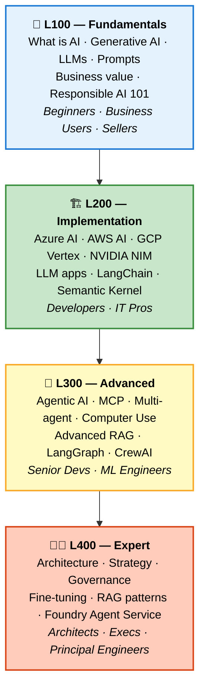

| Level | Audience | Outcome | Time investment |
|---|---|---|---|
| **L100** | Beginners, business users, sellers | Speak AI fluently, pass AI-900 | 20–30 hrs |
| **L200** | Developers, IT pros, architects | Ship a working LLM app | 60–100 hrs |
| **L300** | Senior devs, ML engineers | Build production agentic systems | 100–200 hrs |
| **L400** | Architects, execs, principals | Design enterprise AI strategy + reference architectures | Ongoing |

---

## 👥 Pick Your Track — 4 audience paths

Pick the lane that matches your day job. Each track sequences L100 → L400 differently. Detailed track guides live in [`/docs/tracks/`](./docs/tracks/).

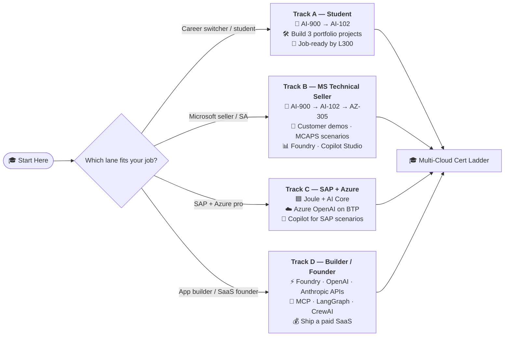

| Track | Best first cert | Signature project | Linked guide |
|---|---|---|---|
| **A · Student / Career Switcher** | AI-900 (or AIF-C01) | RAG chatbot over a public dataset | [docs/tracks/student.md](./docs/tracks/student.md) |
| **B · Microsoft Technical Seller / SA** | AI-900 → AI-102 → AZ-305 | Customer-ready Foundry demo + business case | [docs/tracks/ms-seller.md](./docs/tracks/ms-seller.md) |
| **C · SAP + Azure Pro** | AI-900 + SAP Joule fundamentals | Joule agent + Azure OpenAI on BTP | [docs/tracks/sap-azure.md](./docs/tracks/sap-azure.md) |
| **D · App Builder / SaaS Founder** | AIF-C01 (fastest) → AI-102 | Production agentic SaaS with MCP tooling | [docs/tracks/builder.md](./docs/tracks/builder.md) |

---

## 🧠 L100 — AI Fundamentals & Business Context

> **Goal:** Speak the language. Pass the AI-900 (or AWS AIF-C01). Understand where AI creates business value and where it doesn't.

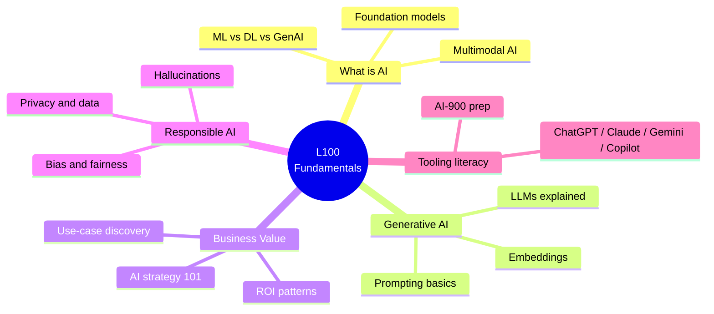

### ⭐ Start here — core foundation

| # | Course | Provider | Duration | Cost | Link |
|---|---|---|---|---|---|
| 1 | **AI For Everyone** (Andrew Ng) | Coursera | ~4 wks (~25h) | Free (audit) | [Coursera](https://www.coursera.org/learn/ai-for-everyone) |
| 2 | **Microsoft Azure AI Fundamentals (AI-900)** | Microsoft Learn | Prep 2–3 wks | $99 exam | [Microsoft Learn](https://learn.microsoft.com/en-us/credentials/certifications/azure-ai-fundamentals/) |
| 3 | **AWS AI Practitioner (AIF-C01)** | AWS | Prep 2–3 wks | $100 exam | [AWS](https://aws.amazon.com/certification/certified-ai-practitioner/) |
| 4 | **Google Generative AI Leader** | Google Cloud | ~90 min exam | $99 | [Google Cloud](https://cloud.google.com/learn/certification/generative-ai-leader) |
| 5 | **Generative AI for Everyone** (DeepLearning.AI) | Coursera | ~3 wks | Free (audit) | [Coursera](https://www.coursera.org/learn/generative-ai-for-everyone) |
| 6 | **Elements of AI** (Univ. of Helsinki) | MOOC | ~30h | Free | [Elements of AI](https://www.elementsofai.com/) |
| 7 | **NVIDIA — Getting Started with Generative AI** | NVIDIA DLI | Self-paced | Free | [NVIDIA DLI](https://www.nvidia.com/en-us/training/online/) |

### 💼 Business value & strategy

| # | Course | Provider | Duration | Cost | Link |
|---|---|---|---|---|---|
| 8 | **Create Business Value from AI** | Microsoft Learn | 6 modules | Free | [Microsoft Learn](https://learn.microsoft.com/en-us/training/paths/create-business-value-from-ai/) |
| 9 | **AI Essentials for Business** | Harvard Business School Online | ~4 wks | Paid | [HBS Online](https://online.hbs.edu/courses/ai-essentials-for-business/) |
| 10 | **AI for Business Leaders** | LinkedIn Learning | ~4h | Subscription | [LinkedIn Learning](https://www.linkedin.com/learning/paths/ai-for-business-leaders) |
| 11 | **AI: Implications for Business Strategy** | MIT Sloan Exec Ed | ~6 wks | Paid | [MIT Sloan](https://executive.mit.edu/course/artificial-intelligence-implications-business-strategy/a056g00000URaa3AAD.html) |

### 📖 Essential reading (free)

- 📰 [State of AI Report](https://www.stateof.ai/) — annual landscape analysis
- 📰 [Microsoft AI Blog](https://blogs.microsoft.com/ai/) — product + strategy updates
- 🔬 [OpenAI Research](https://openai.com/research/) · [Anthropic Research](https://www.anthropic.com/research) · [Google DeepMind](https://deepmind.google/discover/blog/) · [Meta AI](https://ai.meta.com/blog/)
- 📨 [The Batch](https://www.deeplearning.ai/the-batch/) (DeepLearning.AI) · [Import AI](https://importai.substack.com/) · [Stratechery](https://stratechery.com/)
- 📊 [Papers with Code](https://paperswithcode.com/) for the latest benchmarks

### 🛠️ L100 mini-lab — "Hello AI" (2 hours)

1. Sign up for **GitHub Copilot Free** and **ChatGPT Free** (or Claude.ai Free).
2. Use Microsoft Learn's free **Azure AI Foundry Playground** to chat with `gpt-4o-mini` without writing code.
3. Try the **Anthropic Console** to chat with Claude Haiku.
4. Write a one-page **AI use-case discovery doc** for your job — pick one repetitive task and describe how an AI agent would handle it.

---

## 🏗️ L200 — Technical Implementation & Multi-Cloud AI

> **Goal:** Ship a working LLM application. Pick a cloud, learn its AI stack, and build a real RAG app on it.

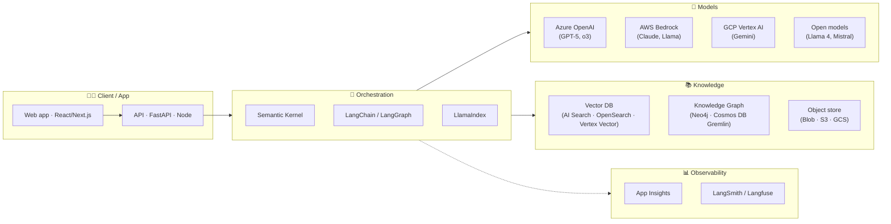

### ☁️ Azure AI development path (primary)

| # | Course / Path | Duration | Link |
|---|---|---|---|
| 1 | **Introduction to AI on Azure** | 12 modules | [MS Learn](https://learn.microsoft.com/en-us/training/paths/introduction-to-ai-on-azure/) |
| 2 | **Develop Generative AI Apps in Azure** | 8 modules | [MS Learn](https://learn.microsoft.com/en-us/training/paths/create-custom-copilots-ai-studio/) |
| 3 | **Build AI Apps with Azure AI Services** | 10 modules | [MS Learn](https://learn.microsoft.com/en-us/training/paths/build-ai-solutions-with-azure-ai-services/) |
| 4 | **Develop AI solutions with Azure OpenAI** | 5 modules | [MS Learn](https://learn.microsoft.com/en-us/training/paths/develop-ai-solutions-azure-openai/) |
| 5 | **Get started with Azure AI Foundry** | Path | [MS Learn](https://learn.microsoft.com/en-us/training/paths/get-started-azure-ai/) |

### 🟧 AWS AI development path

| # | Course / Path | Duration | Link |
|---|---|---|---|
| 6 | **AWS Skill Builder — AI Learning Plans** | Self-paced | [Skill Builder](https://explore.skillbuilder.aws/learn) |
| 7 | **Generative AI with LLMs** (DeepLearning.AI + AWS) | ~3 wks | [Coursera](https://www.coursera.org/learn/generative-ai-with-llms) |
| 8 | **Amazon Bedrock workshops** | Self-paced | [bedrock.aws](https://catalog.workshops.aws/building-with-amazon-bedrock) |
| 9 | **AWS Certified ML Engineer Associate (MLA-C01) prep** | Prep 6–8 wks | [AWS](https://aws.amazon.com/certification/certified-machine-learning-engineer-associate/) |

### 🟦 Google Cloud / Vertex AI path

| # | Course / Path | Duration | Link |
|---|---|---|---|
| 10 | **Generative AI on Vertex AI** learning path | Self-paced | [Cloud Skills Boost](https://www.cloudskillsboost.google/paths/183) |
| 11 | **Generative AI for Developers** | Self-paced | [Cloud Skills Boost](https://www.cloudskillsboost.google/paths/183) |
| 12 | **Build LLM-powered apps with Vertex AI Agent Builder** | Self-paced | [Cloud Skills Boost](https://www.cloudskillsboost.google/) |
| 13 | **Cloud ML Engineer Professional prep** | Prep 8–12 wks | [Cloud Cert](https://cloud.google.com/learn/certification/machine-learning-engineer-professional) |

### 🟩 NVIDIA AI development path

| # | Course / Path | Duration | Link |
|---|---|---|---|
| 14 | **NVIDIA DLI — Building Generative AI Applications** | Self-paced | [NVIDIA DLI](https://www.nvidia.com/en-us/training/online/) |
| 15 | **NVIDIA NIM Microservices Quickstart** | Self-paced | [NVIDIA NIM](https://developer.nvidia.com/nim) |
| 16 | **NVIDIA NeMo Framework** for customization | Hands-on | [NVIDIA NeMo](https://developer.nvidia.com/nemo) |
| 17 | **NCA-GENL prep** (Generative AI LLMs) | Prep 4–6 wks | [NVIDIA Cert](https://www.nvidia.com/en-us/learn/certification/) |

### 🔧 Hands-on dev skills (cloud-agnostic)

| # | Course | Provider | Duration | Cost |
|---|---|---|---|---|
| 18 | **Machine Learning Specialization** (Andrew Ng) | Coursera | ~3 mo | Free (audit) |
| 19 | **Deep Learning Specialization** | DeepLearning.AI | ~5 mo | Free (audit) |
| 20 | **LangChain for LLM App Development** | DeepLearning.AI | ~1 wk | Free |
| 21 | **Building Systems with the ChatGPT API** | DeepLearning.AI | ~1 wk | Free |
| 22 | **Building Generative AI Applications with Gradio** | DeepLearning.AI | ~1 wk | Free |
| 23 | **Hugging Face NLP course** | Hugging Face | Self-paced | Free |

### 🧰 Build stack — what to actually use

| Layer | Pick one | Notes |
|---|---|---|
| **Orchestration** | Semantic Kernel · LangChain · LlamaIndex | SK if you live in .NET / Microsoft. LangChain is most ubiquitous. |
| **Agent runtime** | Microsoft Agent Framework · LangGraph · CrewAI · OpenAI Agents SDK | MAF for MS shops; LangGraph for max flexibility |
| **Vector store** | Azure AI Search · pgvector · Qdrant · Pinecone · Weaviate | AI Search if Azure; pgvector for simplicity |
| **Frontend** | Chainlit · Streamlit · Next.js | Chainlit/Streamlit for prototypes |
| **Observability** | Langfuse · LangSmith · Azure App Insights | Langfuse is OSS-friendly |

### 🛠️ L200 capstone — RAG-powered Q&A app (10–15 hours)

Build a chatbot that answers questions from a 50-page PDF using your cloud of choice. Deliverables: indexer script, retrieval pipeline, chat UI, eval set with 20 Q&A pairs, latency + cost report.

---

## 🤖 L300 — Advanced AI, Agents & MCP

> **Goal:** Build production agentic systems. Master MCP, multi-agent orchestration, advanced RAG, and Computer Use patterns.

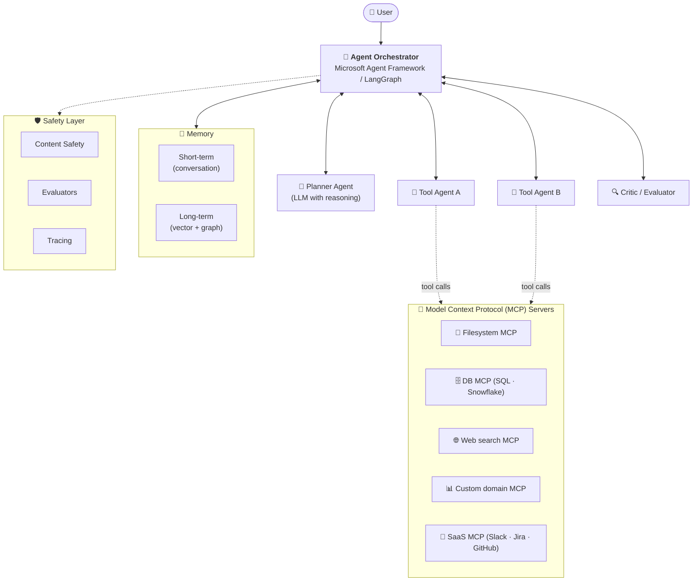

### 🧩 Agentic AI specialization

| # | Course | Provider | Link |
|---|---|---|---|
| 1 | **AI Agents in LangGraph** | DeepLearning.AI | [Course](https://www.deeplearning.ai/short-courses/ai-agents-in-langgraph/) |
| 2 | **Multi-AI-Agent Systems with crewAI** | DeepLearning.AI | [Course](https://www.deeplearning.ai/short-courses/multi-ai-agent-systems-with-crewai/) |
| 3 | **Functions, Tools and Agents with LangChain** | DeepLearning.AI | [Course](https://www.deeplearning.ai/short-courses/functions-tools-agents-langchain/) |
| 4 | **Building Agentic RAG with LlamaIndex** | DeepLearning.AI | [Course](https://www.deeplearning.ai/short-courses/building-agentic-rag-with-llamaindex/) |
| 5 | **Microsoft Agent Framework — Quickstart** | Microsoft Learn | [MS Learn](https://learn.microsoft.com/en-us/azure/ai-foundry/) |
| 6 | **Introduction to Agentic AI** | Cognitive Class (IBM) | [Course](https://cognitiveclass.ai/courses/introduction-to-agentic-ai) |
| 7 | **Agentic AI Fundamentals** | Harvard D^3 | [Course](https://d3.harvard.edu/learning-programs-for-individuals/agentic-ai-fundamentals-add-on/) |

### 🧠 Model Context Protocol (MCP) — must-learn

> MCP is the **USB-C of AI** — one open standard for connecting LLMs to tools, data, and prompts. Backed by Anthropic, OpenAI, Google, Microsoft; donated to the Linux Foundation in Dec 2025.

| # | Resource | Link |
|---|---|---|
| 8 | **MCP official docs** | [modelcontextprotocol.io](https://modelcontextprotocol.io/) |
| 9 | **Anthropic MCP announcement** | [Anthropic Blog](https://www.anthropic.com/news/model-context-protocol) |
| 10 | **MCP Linux Foundation announcement** | [Anthropic Blog](https://www.anthropic.com/news/donating-the-model-context-protocol-and-establishing-of-the-agentic-ai-foundation) |
| 11 | **MCP Python + TypeScript SDKs** | [GitHub org](https://github.com/modelcontextprotocol) |
| 12 | **Awesome MCP Servers** | [Awesome MCP](https://github.com/punkpeye/awesome-mcp-servers) |
| 13 | **Build a custom MCP server tutorial** | [MCP Quickstart](https://modelcontextprotocol.io/quickstart/server) |

### 🎛️ Agent frameworks — pick your fighter

| Framework | Owner | Strengths | Best for |
|---|---|---|---|
| **Microsoft Agent Framework** (AutoGen v0.4 + SK) | Microsoft | Enterprise, .NET + Python, Azure-native | MS shops, enterprise pilots |
| **LangGraph** | LangChain | Stateful graph, durable exec, human-in-the-loop | Complex multi-agent flows |
| **CrewAI** | crewAI | Role-based crews, simple mental model | Quick multi-agent prototypes |
| **OpenAI Agents SDK** (formerly Swarm) | OpenAI | Lightweight, OpenAI-tuned | OpenAI-only stacks |
| **Google ADK** | Google | Vertex AI Agent Builder integration | GCP-native deployments |
| **AutoGPT / BabyAGI** | OSS | Pioneers, mostly historical | Learning the concepts |

### 🔬 Advanced RAG & retrieval patterns

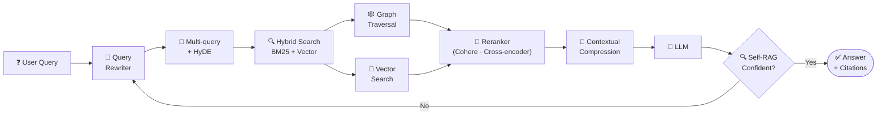

| Pattern | When to use | Reference |
|---|---|---|
| **Naive RAG** | Quick prototype | LangChain docs |
| **Hybrid (BM25 + vector)** | Production baseline | Azure AI Search, Weaviate |
| **GraphRAG** | Multi-hop reasoning, complex KB | [Microsoft GraphRAG](https://github.com/microsoft/graphrag) |
| **Contextual Retrieval** | High-accuracy knowledge bases | [Anthropic Contextual Retrieval](https://www.anthropic.com/news/contextual-retrieval) |
| **Agentic RAG** | Multi-step queries, dynamic decomposition | LangGraph docs |
| **Self-RAG** | Reduce hallucinations | [Self-RAG paper](https://arxiv.org/abs/2310.11511) |
| **RAPTOR** | Hierarchical document QA | [RAPTOR](https://github.com/parthsarthi03/raptor) |
| **ColBERT v2** | Latency-sensitive late-interaction | [ColBERT](https://github.com/stanford-futuredata/ColBERT) |

### 🖥️ Computer Use / Operator agents

| # | Resource | Provider | Link |
|---|---|---|---|
| 14 | **Anthropic Computer Use tool** | Anthropic | [Docs](https://docs.anthropic.com/en/docs/agents-and-tools/computer-use) |
| 15 | **OpenAI Operator / ChatGPT Agent Mode** | OpenAI | [OpenAI](https://openai.com/index/introducing-operator/) |
| 16 | **Browser-use (open-source)** | OSS | [GitHub](https://github.com/browser-use/browser-use) |
| 17 | **Skyvern** (OSS browser agents) | OSS | [GitHub](https://github.com/Skyvern-AI/skyvern) |

### 🛠️ L300 capstone — multi-agent assistant with MCP (20–40 hours)

Build a research-and-act assistant: planner agent + 2 tool agents + critic, talking to 3+ MCP servers (filesystem, web search, database). Add tracing (Langfuse) and evals (10+ test cases). Deploy on Azure Container Apps or AWS Fargate.

---

## 🧑‍💼 L400 — Expert Architecture, Strategy & Governance

> **Goal:** Lead AI strategy. Design enterprise reference architectures. Master fine-tuning. Govern AI risk.

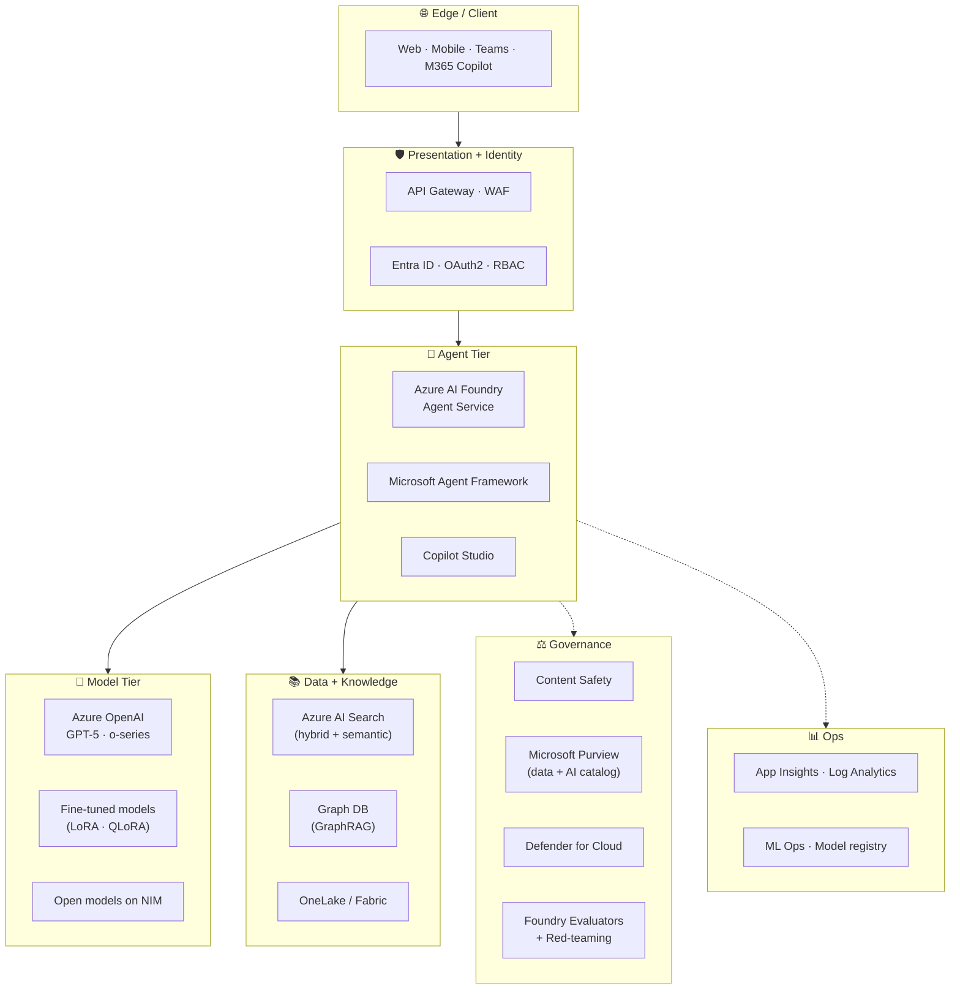

### 🧭 Executive AI leadership programs

| # | Program | Provider | Duration | Audience |
|---|---|---|---|---|
| 1 | **AI for Senior Executives** | MIT xPRO | ~6 mo | C-suite / VP |
| 2 | **Berkeley Exec Program in Digital Strategy & AI** | UC Berkeley | ~8 mo | Senior leaders |
| 3 | **Oxford AI-Driven Business Transformation** | Oxford Saïd | ~6 mo | Executives |
| 4 | **Wharton AI for Business** | Wharton Online | ~6 wks | Business leaders |
| 5 | **Stanford LEAD with AI** | Stanford GSB | ~1 yr | Senior leaders |

### 🛡️ Responsible AI, regulation & governance

| # | Resource | Description | Link |
|---|---|---|---|
| 6 | **Microsoft Responsible AI Standard** | Microsoft's official RAI framework | [Microsoft](https://www.microsoft.com/en-us/ai/responsible-ai) |
| 7 | **NIST AI Risk Management Framework (AI RMF 1.0)** | US gov AI risk standard | [NIST](https://www.nist.gov/itl/ai-risk-management-framework) |
| 8 | **ISO/IEC 42001** | International AI management system standard | [ISO](https://www.iso.org/standard/81230.html) |
| 9 | **EU AI Act** | EU regulatory framework (in force) | [EU AI Act](https://artificialintelligenceact.eu/) |
| 10 | **OWASP Top 10 for LLM Applications** | Security risks in LLM apps | [OWASP](https://owasp.org/www-project-top-10-for-large-language-model-applications/) |
| 11 | **Microsoft AI Red Team** | Practical red-teaming guidance | [Microsoft](https://learn.microsoft.com/en-us/security/ai-red-team/) |

### 🎛️ LLM fine-tuning deep dive

| Method | Memory | Speed | Use case | Reference |
|---|---|---|---|---|
| **Full fine-tuning** | High | Slow | Maximum customization, regulated domains | Hugging Face Trainer |
| **LoRA** | Low | Fast | Style/domain adaptation, default for most | [LoRA paper](https://arxiv.org/abs/2106.09685) |
| **QLoRA** | Very low | Medium | Single-GPU fine-tuning | [QLoRA](https://github.com/artidoro/qlora) |
| **Prefix / P-tuning** | Low | Fast | Task-specific prompts | Hugging Face PEFT |
| **DPO** | Medium | Medium | Preference alignment (cheaper RLHF) | [DPO paper](https://arxiv.org/abs/2305.18290) |
| **RLHF / RLAIF** | High | Slow | Frontier-grade alignment | [Anthropic Constitutional AI](https://www.anthropic.com/news/claudes-constitution) |
| **GRPO** | Medium | Medium | Reasoning-style fine-tuning | [DeepSeek-R1 paper](https://arxiv.org/abs/2501.12948) |

| # | Tool | Use | Link |
|---|---|---|---|
| 12 | **Hugging Face PEFT** | LoRA/QLoRA library | [PEFT docs](https://huggingface.co/docs/peft) |
| 13 | **Axolotl** | Streamlined fine-tuning configs | [Axolotl](https://github.com/OpenAccess-AI-Collective/axolotl) |
| 14 | **LLaMA-Factory** | Multi-model fine-tuning UI | [LLaMA-Factory](https://github.com/hiyouga/LLaMA-Factory) |
| 15 | **Unsloth** | 2–5× faster fine-tuning, 80% less memory | [Unsloth](https://github.com/unslothai/unsloth) |
| 16 | **Azure OpenAI fine-tuning** | Enterprise managed | [MS Learn](https://learn.microsoft.com/en-us/azure/ai-services/openai/how-to/fine-tuning) |
| 17 | **NVIDIA NeMo Customizer** | NVIDIA's customization stack | [NeMo Customizer](https://developer.nvidia.com/nemo) |

### 🏭 Azure AI Foundry — enterprise platform

| # | Resource | Description | Link |
|---|---|---|---|
| 18 | **Azure AI Foundry overview** | Unified AI dev + agent platform | [Azure](https://azure.microsoft.com/en-us/products/ai-foundry) |
| 19 | **Foundry Agent Service** | Hosted agents w/ memory + tools | [MS Learn](https://learn.microsoft.com/en-us/azure/ai-foundry/agents/) |
| 20 | **Foundry Model Catalog** | 1,800+ models incl. OpenAI, Llama, Mistral, Cohere | [Model Catalog](https://ai.azure.com/explore/models) |
| 21 | **Prompt Flow** | Visual LLM workflow designer | [MS Learn](https://learn.microsoft.com/en-us/azure/ai-studio/how-to/prompt-flow) |
| 22 | **Foundry SDK** | Programmatic access | [MS Learn](https://learn.microsoft.com/en-us/azure/ai-studio/how-to/sdk-generative-ai) |
| 23 | **VS Code extension for Foundry** | IDE integration | [Marketplace](https://marketplace.visualstudio.com/items?itemName=ms-azuretools.vscode-azure-ai) |

### 🔬 Advanced technical mastery

| # | Resource | Provider | Link |
|---|---|---|---|
| 24 | **Stanford CS229 — Machine Learning** | Stanford | [Stanford Online](https://online.stanford.edu/courses/cs229-machine-learning) |
| 25 | **Stanford CS224N — NLP w/ Deep Learning** | Stanford | [Stanford Online](https://online.stanford.edu/courses/cs224n-natural-language-processing-deep-learning) |
| 26 | **Stanford CS336 — Language Models from Scratch** | Stanford | [Stanford](https://stanford-cs336.github.io/) |
| 27 | **fast.ai — Practical Deep Learning** | fast.ai | [fast.ai](https://www.fast.ai/) |
| 28 | **Hugging Face — Smol Course (LLM training)** | HF | [GitHub](https://github.com/huggingface/smol-course) |

---

## 🎓 Multi-Cloud Certification Ladder

Four parallel tracks. Pick **one as primary** based on your org, and add a fundamentals cert from a second cloud for breadth.

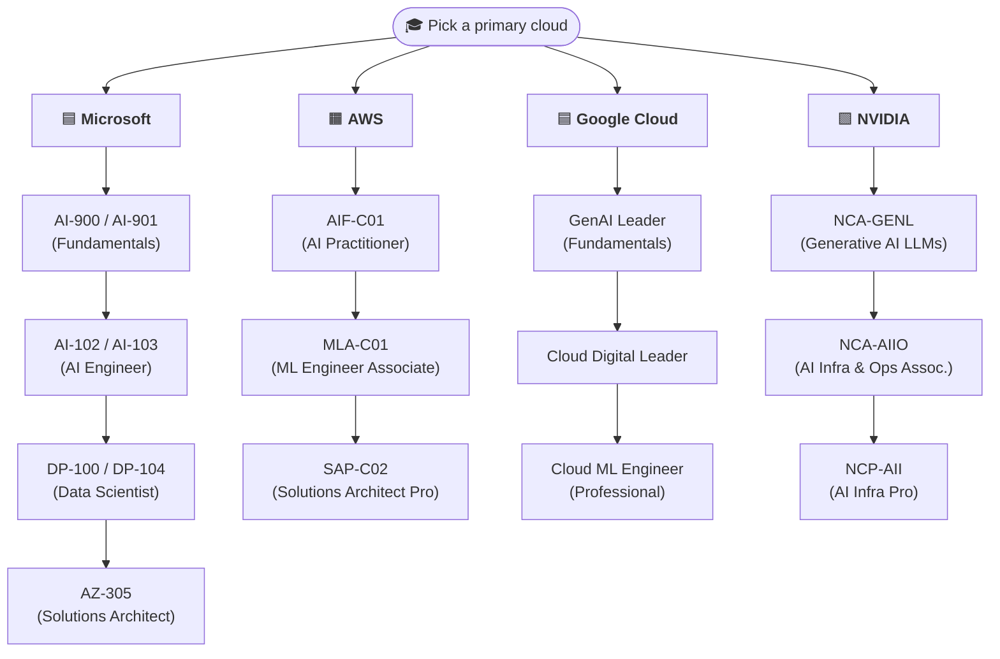

### 🟦 Microsoft

| Cert | Code | Level | Cost | Duration | Status (May 2026) | Link |
|---|---|---|---|---|---|---|
| Azure AI Fundamentals | **AI-900** | L100 | $99 | 45 min | ⚠️ Retiring **June 30, 2026** | [Link](https://learn.microsoft.com/en-us/credentials/certifications/azure-ai-fundamentals/) |
| Azure AI Fundamentals (new) | **AI-901** | L100 | $99 | 60 min | 🆕 Beta — focused on Foundry + Agentic AI | [Link](https://learn.microsoft.com/en-us/credentials/certifications/) |
| Azure AI Engineer Associate | **AI-102** | L300 | $165 | 100 min | ⚠️ Retiring **June 30, 2026** | [Link](https://learn.microsoft.com/en-us/credentials/certifications/azure-ai-engineer/) |
| Azure AI Engineer Associate (new) | **AI-103** | L300 | $165 | ~100 min | 🆕 Replaces AI-102 | [Link](https://learn.microsoft.com/en-us/credentials/certifications/) |
| Azure Data Scientist Associate | **DP-100 / DP-104** | L300 | $165 | 100 min | DP-100 retiring June 1, 2026 | [Link](https://learn.microsoft.com/en-us/credentials/certifications/azure-data-scientist/) |
| Azure Solutions Architect Expert | **AZ-305** | L400 | $165 | 120 min | Active | [Link](https://learn.microsoft.com/en-us/credentials/certifications/azure-solutions-architect/) |
| Microsoft Applied Skills (AI) | (multiple) | L100–L300 | Free–low | varies | Hands-on assessments | [Link](https://learn.microsoft.com/en-us/credentials/applied-skills/) |

### 🟧 AWS

| Cert | Code | Level | Cost | Duration | Status (May 2026) | Link |
|---|---|---|---|---|---|---|
| AI Practitioner | **AIF-C01** | L100 | $100 | 90 min | Flagship entry cert | [Link](https://aws.amazon.com/certification/certified-ai-practitioner/) |
| ML Engineer Associate | **MLA-C01** | L300 | $300 | 170 min | Active, replaces MLS-C01 | [Link](https://aws.amazon.com/certification/certified-machine-learning-engineer-associate/) |
| ML Specialty | **MLS-C01** | L300 | $300 | 180 min | ⚠️ Retiring March 31, 2026 | [Link](https://aws.amazon.com/certification/certified-machine-learning-specialty/) |
| Solutions Architect Professional | **SAP-C02** | L400 | $300 | 180 min | Active | [Link](https://aws.amazon.com/certification/certified-solutions-architect-professional/) |

### 🟦 Google Cloud

| Cert | Code | Level | Cost | Duration | Status | Link |
|---|---|---|---|---|---|---|
| Generative AI Leader | — | L100 | $99 | 90 min | Active — business-focused | [Link](https://cloud.google.com/learn/certification/generative-ai-leader) |
| Cloud Digital Leader | — | L100 | $99 | 90 min | Active | [Link](https://cloud.google.com/learn/certification/cloud-digital-leader) |
| Professional Cloud ML Engineer | — | L300 | $200 | 120 min | Active | [Link](https://cloud.google.com/learn/certification/machine-learning-engineer-professional) |
| Professional Cloud Architect | — | L400 | $200 | 120 min | Active | [Link](https://cloud.google.com/learn/certification/cloud-architect) |

### 🟩 NVIDIA

| Cert | Code | Level | Cost | Duration | Status | Link |
|---|---|---|---|---|---|---|
| Generative AI LLMs Associate | **NCA-GENL** | L200 | $125 | 60 min | Active — top entry cert | [Link](https://www.nvidia.com/en-us/learn/certification/) |
| AI Infrastructure & Operations Associate | **NCA-AIIO** | L200 | $125 | 60 min | Active | [Link](https://www.nvidia.com/en-us/learn/certification/) |
| AI Infrastructure Professional | **NCP-AII** | L400 | $400 | 90 min | Active | [Link](https://www.nvidia.com/en-us/learn/certification/) |
| NVIDIA DLI Course Certificates | varies | L100–L300 | Free–$100 | self-paced | Completion badges | [Link](https://www.nvidia.com/en-us/training/online/) |

### 📊 Cert priority guide

| Priority | Best for | Pick |
|---|---|---|
| 1️⃣ | Anyone starting | **AI-901** (or AI-900 if before June 2026) · or **AIF-C01** |
| 2️⃣ | Cloud builders | **AI-103** (Azure) or **MLA-C01** (AWS) |
| 3️⃣ | ML/Data scientists | **DP-104** or Google **Cloud ML Engineer** |
| 4️⃣ | Architects | **AZ-305** + **NCP-AII** for AI infra cred |
| 5️⃣ | GPU/Infra specialists | **NCA-AIIO → NCP-AII** |

---

## 🟦 SAP Joule Track (NEW for 2026)

> SAP customers and consultants — this track is for you. Joule moved from copilot to **agentic platform** in 2026.

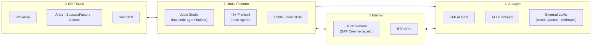

| # | Resource | Description | Link |
|---|---|---|---|
| 1 | **Joule overview** | SAP's enterprise copilot + agent platform | [SAP](https://www.sap.com/products/artificial-intelligence/ai-assistant.html) |
| 2 | **SAP AI Core** | Train + serve ML models on BTP | [SAP Help](https://help.sap.com/docs/ai-core) |
| 3 | **SAP AI Launchpad** | Lifecycle UI for AI assets | [SAP Help](https://help.sap.com/docs/ai-launchpad) |
| 4 | **Azure OpenAI on SAP BTP** | Reference architecture from Microsoft | [MS Learn](https://learn.microsoft.com/en-us/azure/sap/) |
| 5 | **SAP Learning Hub — AI paths** | Official SAP training | [SAP Learning](https://learning.sap.com/learning-journeys?solution=Artificial+Intelligence) |
| 6 | **OpenSAP — Generative AI at SAP** | Free MOOCs | [OpenSAP](https://open.sap.com/) |
| 7 | **Joule Studio walkthrough** | Build your first Joule agent | [SAP News](https://news.sap.com/topics/joule/) |

**SAP + Azure architecture pattern:** Joule fronts the user → Joule Studio agent → Azure OpenAI for reasoning → SAP AI Core for fine-tuned models → S/4HANA + BTP for system-of-record actions.

---

## 🤖 Frontier Models Reference (May 2026)

> Snapshot of the model landscape. Pricing/availability changes fast — verify on the provider page before committing.

| Provider | Flagship | Mid-tier | Small / fast | Reasoning | Notes |
|---|---|---|---|---|---|
| **OpenAI** | GPT-5 | GPT-5 mini | GPT-5 nano | o3, o4-mini | Operator / Agent Mode in ChatGPT |
| **Anthropic** | Claude Opus 4.7 | Claude Sonnet 4.6 | Claude Haiku 4.5 | Extended thinking | Native Computer Use tool |
| **Google** | Gemini 3 Pro | Gemini 3 Flash | Flash-Lite | Gemini Thinking | Vertex AI + Gemini API |
| **Meta** | Llama 4 Maverick | Llama 4 Scout | Llama 3.x family | — | Open-weights, commercial license |
| **xAI** | Grok 4 | Grok 4 mini | — | Grok reasoning | x.com / API |
| **DeepSeek** | DeepSeek-V3.x | — | — | DeepSeek-R1 | Strong open reasoning models |
| **Mistral** | Mistral Large | Mistral Medium | Ministral | Magistral | EU sovereign option |
| **Cohere** | Command R+ | Command R | — | — | Enterprise RAG focus |

**Where to access:**
- [Azure AI Foundry Model Catalog](https://ai.azure.com/explore/models) (1,800+ models)
- [AWS Bedrock](https://aws.amazon.com/bedrock/) · [GCP Vertex Model Garden](https://cloud.google.com/vertex-ai/generative-ai/docs/model-garden/explore-models)
- [Hugging Face](https://huggingface.co/models) · [Ollama](https://ollama.ai/) · [LM Studio](https://lmstudio.ai/)

---

## 🛠️ Top GitHub Repos & Sample Projects

> Best-in-class open-source projects for learning and building. Star counts approximate as of May 2026.

### 🏆 LLM frameworks

| Repo | Stars | What | Link |
|---|---|---|---|
| LangChain | 100k+ | LLM app framework | [GitHub](https://github.com/langchain-ai/langchain) |
| LlamaIndex | 38k+ | Data framework for LLMs | [GitHub](https://github.com/run-llama/llama_index) |
| Semantic Kernel | 25k+ | Microsoft's AI orchestration SDK | [GitHub](https://github.com/microsoft/semantic-kernel) |
| Haystack | 18k+ | End-to-end NLP framework | [GitHub](https://github.com/deepset-ai/haystack) |
| DSPy | 22k+ | Programming with foundation models | [GitHub](https://github.com/stanfordnlp/dspy) |

### 🤖 Agent frameworks

| Repo | Stars | What | Link |
|---|---|---|---|
| Microsoft Agent Framework (AutoGen) | 40k+ | Microsoft's unified agent SDK | [GitHub](https://github.com/microsoft/autogen) |
| LangGraph | 11k+ | Stateful agent graphs | [GitHub](https://github.com/langchain-ai/langgraph) |
| CrewAI | 25k+ | Role-based multi-agent crews | [GitHub](https://github.com/crewAIInc/crewAI) |
| OpenAI Agents SDK | 12k+ | OpenAI's agent SDK | [GitHub](https://github.com/openai/openai-agents-python) |
| AutoGPT | 170k+ | Autonomous GPT pioneer | [GitHub](https://github.com/Significant-Gravitas/AutoGPT) |

### 🧩 MCP (Model Context Protocol)

| Repo | What | Link |
|---|---|---|
| MCP spec | The open standard | [GitHub](https://github.com/modelcontextprotocol) |
| Awesome MCP Servers | Curated MCP server list | [GitHub](https://github.com/punkpeye/awesome-mcp-servers) |
| MCP Inspector | Debug + test MCP servers | [GitHub](https://github.com/modelcontextprotocol/inspector) |
| Reference servers (Anthropic) | Filesystem, GitHub, Slack, Postgres, etc. | [GitHub](https://github.com/modelcontextprotocol/servers) |

### 🔧 LLM dev & inference

| Repo | Stars | What | Link |
|---|---|---|---|
| Ollama | 110k+ | Run LLMs locally | [GitHub](https://github.com/ollama/ollama) |
| vLLM | 35k+ | High-throughput LLM serving | [GitHub](https://github.com/vllm-project/vllm) |
| Text Generation WebUI | 42k+ | Gradio LLM UI | [GitHub](https://github.com/oobabooga/text-generation-webui) |
| LocalAI | 28k+ | OpenAI-compatible local | [GitHub](https://github.com/mudler/LocalAI) |
| LitGPT | 12k+ | Pretrain/finetune/deploy | [GitHub](https://github.com/Lightning-AI/litgpt) |

### 📚 Learning resources

| Repo | Stars | What | Link |
|---|---|---|---|
| Generative AI for Beginners (Microsoft) | 80k+ | 21-lesson course | [GitHub](https://github.com/microsoft/generative-ai-for-beginners) |
| AI Agents for Beginners (Microsoft) | 25k+ | 10-lesson agents course | [GitHub](https://github.com/microsoft/ai-agents-for-beginners) |
| MCP for Beginners (Microsoft) | 10k+ | MCP intro course | [GitHub](https://github.com/microsoft/mcp-for-beginners) |
| LLM Course (Maxime Labonne) | 45k+ | Notebooks-based LLM course | [GitHub](https://github.com/mlabonne/llm-course) |
| Awesome LLM | 22k+ | Curated LLM resources | [GitHub](https://github.com/Hannibal046/Awesome-LLM) |

### 🏗️ RAG & vector databases

| Repo | Stars | What | Link |
|---|---|---|---|
| Microsoft GraphRAG | 22k+ | Graph-based RAG | [GitHub](https://github.com/microsoft/graphrag) |
| Chroma | 18k+ | AI-native embedding DB | [GitHub](https://github.com/chroma-core/chroma) |
| Qdrant | 22k+ | Vector DB | [GitHub](https://github.com/qdrant/qdrant) |
| Milvus | 33k+ | Scalable vector DB | [GitHub](https://github.com/milvus-io/milvus) |
| Weaviate | 13k+ | AI-native vector DB | [GitHub](https://github.com/weaviate/weaviate) |
| RAGFlow | 30k+ | OSS RAG engine | [GitHub](https://github.com/infiniflow/ragflow) |

### 🎨 Multimodal & vision

| Repo | Stars | What | Link |
|---|---|---|---|
| LLaVA | 22k+ | Vision-language assistant | [GitHub](https://github.com/haotian-liu/LLaVA) |
| Stable Diffusion WebUI | 145k+ | Image gen UI | [GitHub](https://github.com/AUTOMATIC1111/stable-diffusion-webui) |
| ComfyUI | 65k+ | Node-based diffusion | [GitHub](https://github.com/comfyanonymous/ComfyUI) |

### 🔒 Enterprise & production

| Repo | Stars | What | Link |
|---|---|---|---|
| LiteLLM | 18k+ | Unified API for 100+ LLMs | [GitHub](https://github.com/BerriAI/litellm) |
| Dify | 60k+ | LLMOps app platform | [GitHub](https://github.com/langgenius/dify) |
| Open WebUI | 55k+ | Self-hosted ChatGPT-like UI | [GitHub](https://github.com/open-webui/open-webui) |
| PrivateGPT | 55k+ | Private doc Q&A | [GitHub](https://github.com/zylon-ai/private-gpt) |
| Flowise | 33k+ | Drag-and-drop LLM flows | [GitHub](https://github.com/FlowiseAI/Flowise) |

---

## 🧱 Recommended Learning Sequences

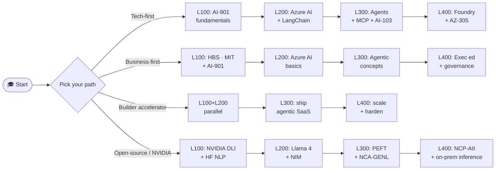

| Path | Best for | Key milestones |
|---|---|---|
| **Tech-first** | Engineers, devs | AI-901 → AI-103 → AZ-305 |
| **Business-first** | Sellers, leaders | HBS/MIT → AI-901 → exec ed |
| **Builder accelerator** | Founders, indie hackers | Skip certs early; ship in 8 weeks; certify after PMF |
| **Open-source / NVIDIA** | Privacy-sensitive, on-prem | Llama 4 + NIM + PEFT + NCP-AII |

Detailed track guides: [`/docs/tracks/`](./docs/tracks/) · Cert deep-dives: [`/docs/certifications/`](./docs/certifications/)

---

## 🤝 Community & Contributing

### Communities

| Community | What | Link |
|---|---|---|
| Microsoft Learn Q&A | Official Microsoft forums | [MS Q&A](https://learn.microsoft.com/en-us/answers/) |
| Hugging Face Forums | OSS AI community | [HF](https://discuss.huggingface.co/) |
| LangChain Discord | LLM apps + agents | [Discord](https://discord.gg/langchain) |
| MCP Discord | Model Context Protocol | [MCP](https://modelcontextprotocol.io/) |
| r/LocalLLaMA | OSS LLM community | [Reddit](https://www.reddit.com/r/LocalLLaMA/) |
| r/MachineLearning | ML research | [Reddit](https://www.reddit.com/r/MachineLearning/) |

### Contributing

PRs welcome — see [CONTRIBUTING.md](./CONTRIBUTING.md). Especially looking for:
- Broken-link reports (use a GitHub Issue)
- New L100 starter labs translated for non-English audiences
- SAP Joule + Azure scenario walkthroughs
- Cert exam tip sheets

### Stay current

- [Microsoft AI Blog](https://blogs.microsoft.com/ai/) · [Azure AI Foundry Blog](https://techcommunity.microsoft.com/category/azure-ai)
- [The Batch](https://www.deeplearning.ai/the-batch/) · [Import AI](https://importai.substack.com/)
- [Papers with Code](https://paperswithcode.com/) · [Hugging Face Daily Papers](https://huggingface.co/papers)
- [SAP News — AI](https://news.sap.com/topics/joule/) · [NVIDIA Blog](https://blogs.nvidia.com/)

---

## 📝 License & Notes

- 📄 Released under the [MIT License](LICENSE) — use, fork, share freely.
- ⚠️ Pricing, dates, and program details from third parties change often. Verify on the provider's official page before committing money or time.
- 🔄 The AI field shifts in weeks, not years. This roadmap is updated quarterly — pin a release if you depend on stable links.
- 💬 Found a dead link or outdated cert info? [Open an Issue](https://github.com/amitlals/AI-Mastery-Roadmap-2025-Business-AI-Azure-AI-Agentic-AI-Beginner-to-Expert-L100-L400-/issues).
- ⭐ If this helped you, please star the repo so others can find it.

---

*Last updated: **May 2026** · Maintained by [@amitlals](https://github.com/amitlals) · Built for students, sellers, builders, and SAP+Azure pros.*
