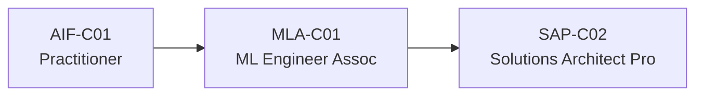

# 🟧 AWS AI Certifications — Deep Dive

> May 2026 status: AWS is **consolidating** the ML track. The MLS-C01 Specialty retires March 31, 2026; MLA-C01 Associate is the new flagship.

## Active certifications

| Cert | Code | Level | Cost | Duration | Best for |
|---|---|---|---|---|---|
| AWS Certified AI Practitioner | AIF-C01 | L100 | $100 | 90 min | Anyone — fastest entry into AWS AI |
| ML Engineer Associate | MLA-C01 | L300 | $300 | 170 min | Devs / engineers — replaces MLS-C01 |
| ML Specialty | MLS-C01 | L300 | $300 | 180 min | ⚠️ Retiring March 31, 2026 |
| Solutions Architect Professional | SAP-C02 | L400 | $300 | 180 min | Architects |

## Recommended sequence

## What's tested

### AIF-C01 (AI Practitioner)
- AI / ML / generative AI concepts
- Amazon Bedrock + foundation models
- Amazon Q (business + developer)
- Amazon SageMaker basics
- Responsible AI on AWS
- 65 questions, 90 min, $100

### MLA-C01 (ML Engineer Associate)
- Data engineering for ML (S3, Glue, Feature Store)
- Model development on SageMaker
- Deployment + monitoring (SageMaker endpoints, Pipelines)
- Generative AI with Bedrock
- MLOps basics

## Study resources

- 📘 **AWS Skill Builder** (free + paid) — start here
- 🎥 **Stephane Maarek (Udemy)** — gold-standard course author for AWS
- 🎥 **Adrian Cantrill** — deep-dive videos
- 📚 **Tutorials Dojo** — practice tests, widely recommended
- 📝 **Whizlabs / ExamTopics** — supplementary practice

## Bedrock build experience

Build a small project before sitting MLA-C01:
1. Bedrock Knowledge Base (RAG over an S3 bucket)
2. Bedrock Agents calling a Lambda function
3. Fine-tune a Bedrock-hosted model (Cohere Command, Llama)
4. Deploy a SageMaker endpoint with custom inference

[Bedrock workshops](https://catalog.workshops.aws/building-with-amazon-bedrock)

## AIF-C01 vs AI-900 — should I do both?

If you live in a multi-cloud world: yes, both. They're cheap, fast, and signal multi-cloud literacy. AIF-C01 is broader (covers Q, Bedrock, SageMaker); AI-900 is deeper on Azure AI services.

← [Back to README](../../README.md)
