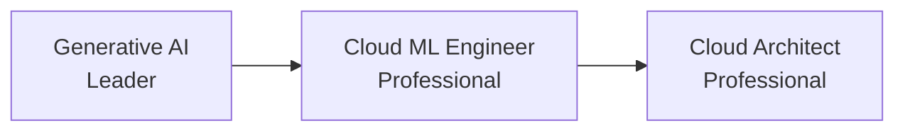

# 🟦 Google Cloud AI Certifications — Deep Dive

> May 2026 status: GCP's AI cert lineup is **stable but lighter** than AWS/Azure. Strong for ML engineers; lighter for builders.

## Active certifications

| Cert | Level | Cost | Duration | Best for |
|---|---|---|---|---|
| Generative AI Leader | L100 | $99 | 90 min | Business leaders, sellers |
| Cloud Digital Leader | L100 | $99 | 90 min | Generalists |
| Professional Cloud ML Engineer | L300 | $200 | 120 min | ML engineers |
| Professional Cloud Architect | L400 | $200 | 120 min | Architects |
| Professional Data Engineer | L300 | $200 | 120 min | Data + ML hybrid roles |

## Recommended sequence

## What's tested

### Generative AI Leader
- GenAI fundamentals
- Vertex AI Model Garden (Gemini, Llama, Claude on Vertex)
- Vertex AI Agent Builder
- Responsible AI at Google
- Conceptual / non-technical (no code)

### Professional Cloud ML Engineer
- Vertex AI training + deployment
- BigQuery ML
- Pipelines (Kubeflow, Vertex AI Pipelines)
- TensorFlow / JAX / PyTorch on GCP
- Model monitoring + retraining
- 60 scenario-based questions

## Study resources

- 📘 **Google Cloud Skills Boost** (free first 30 days for some paths)
- 🎥 **Coursera — Generative AI on Vertex AI** specialization
- 🎥 **Tony Brace (Udemy)** — course
- 📚 **Linux Academy / A Cloud Guru** — paid
- 🧪 **Qwiklabs hands-on** — included with Skills Boost

## Hands-on before the exam

- Deploy Gemini through Vertex AI
- Build a Vertex AI Agent Builder agent
- Train a custom model on Vertex AI
- Run a BigQuery ML linear regression
- Deploy + monitor a model endpoint

## When to choose GCP over Azure / AWS

- Heavy data analytics + BigQuery shop
- Search + recommendations workloads
- Gemini-specific features (deep multimodal, large context)
- Open-source ML stack (TF, Keras, JAX)

← [Back to README](../../README.md)
