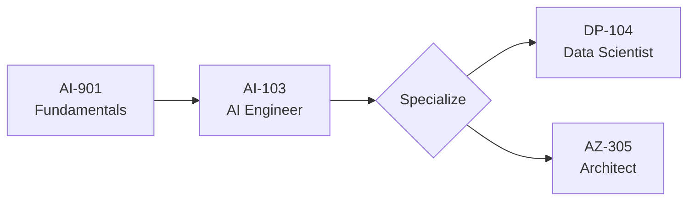

# 🟦 Microsoft AI Certifications — Deep Dive

> May 2026 status: Microsoft is **resetting its AI cert portfolio** around the Foundry platform. AI-900, AI-102, DP-100 retire mid-2026; AI-901, AI-103, DP-104 take over.

## Active certifications

| Cert | Code | Level | Cost | Duration | Best for |
|---|---|---|---|---|---|
| Azure AI Fundamentals | AI-900 | L100 | $99 | 45 min | Beginners — retiring June 30, 2026 |
| Azure AI Fundamentals (new) | AI-901 | L100 | $99 | 60 min | New entry-point, Foundry + agents |
| Azure AI Engineer Associate | AI-102 | L300 | $165 | 100 min | Devs — retiring June 30, 2026 |
| Azure AI Engineer Associate (new) | AI-103 | L300 | $165 | ~100 min | Replaces AI-102 |
| Azure Data Scientist Associate | DP-100 / DP-104 | L300 | $165 | 100 min | DP-100 retiring June 1, 2026 |
| Azure Solutions Architect Expert | AZ-305 | L400 | $165 | 120 min | Architects (AI + cloud) |
| Microsoft Applied Skills (AI) | multiple | L100–L300 | low/free | varies | Hands-on validation |

## Recommended sequence

## What's tested (high-level)

### AI-901 (new fundamentals)
- Azure AI Foundry overview
- Generative AI concepts (LLMs, embeddings, prompts, RAG)
- Agentic AI fundamentals (MCP, agents, tools)
- Responsible AI in Azure
- Pricing + provisioned throughput basics

### AI-103 (new AI Engineer)
- Azure AI Search — hybrid + semantic
- Azure OpenAI deployment + fine-tuning
- Foundry Agent Service — building, deploying, monitoring agents
- Prompt Flow + evaluators
- Azure AI Vision, Document Intelligence, Speech
- MCP integration patterns

### AZ-305 (Solutions Architect Expert)
Not AI-specific, but you should master:
- Identity + Entra ID
- Networking, private endpoints
- Cost optimization
- DR / BCP for AI workloads

## Study resources

- 📘 **Microsoft Learn paths** (free, official) — start here always
- 📗 **MeasureUp practice tests** — gold standard
- 🎥 **John Savill's Technical Training** YouTube — best free deep dives
- 🎥 **Tim Warner / Adam Marczak** YouTube — exam-targeted
- 📚 **Pluralsight / A Cloud Guru** — paid, course-style
- 📝 **Whizlabs** — cheaper practice tests

## Microsoft Applied Skills (free hands-on)

Don't skip these — they're free, fast (~2h), and directly resume-relevant:
- Develop generative AI solutions with Azure OpenAI
- Build a chatbot with Azure AI Foundry
- Develop an AI app with the Azure AI Foundry SDK
- Implement document processing with Azure AI Document Intelligence

[Browse Applied Skills](https://learn.microsoft.com/en-us/credentials/applied-skills/)

## Should I rush AI-900 before June 30, 2026?

**Short answer:** No. AI-901 is more valuable going forward. The legacy AI-900 will still appear on your transcript, but it'll be marked as "retired." If you've started studying for AI-900, finish it; otherwise, switch to AI-901 prep.

← [Back to README](../../README.md)
