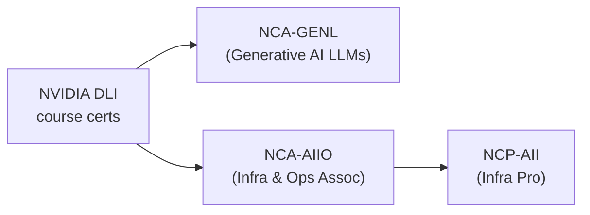

# 🟩 NVIDIA AI Certifications — Deep Dive

> May 2026 status: NVIDIA's cert program **expanded** in 2025–26 to cover both AI generalist + AI infrastructure tracks. Strong signal for GPU + on-prem + agentic-infra roles.

## Active certifications

| Cert | Code | Level | Cost | Duration | Best for |
|---|---|---|---|---|---|
| Generative AI LLMs Associate | NCA-GENL | L200 | $125 | 60 min | LLM developers |
| AI Infrastructure & Operations Associate | NCA-AIIO | L200 | $125 | 60 min | DevOps / infra engineers |
| AI Infrastructure Professional | NCP-AII | L400 | $400 | 90 min | Senior infra / SRE |

Plus **NVIDIA DLI course completion certificates** (not formal certs, but resume-strong): Free–$100, self-paced.

## Recommended sequence

## What's tested

### NCA-GENL (Generative AI LLMs Associate)
- Generative AI + LLM fundamentals
- Transformer architecture
- Fine-tuning with NeMo + PEFT
- NIM microservices for inference
- Prompt engineering + RAG basics
- Cuda / GPU acceleration concepts

### NCA-AIIO (AI Infrastructure & Operations)
- DGX systems + InfiniBand networking
- AI Enterprise software stack
- Triton Inference Server
- GPU monitoring + diagnostics
- Cluster management (Base Command, Slurm)

### NCP-AII (Infrastructure Professional)
- Multi-node DGX SuperPOD
- Liquid cooling + power planning
- Performance tuning at cluster scale
- AI workload scheduling

## Study resources

- 📘 **NVIDIA DLI courses** (some free, $90 paid) — start here
- 📚 **NVIDIA Developer site** — official docs
- 🎥 **GTC session recordings** — free, world-class
- 📖 **NVIDIA Deep Learning Institute book + workshop** — paid, deep
- 🛠️ **Hands-on:** spin up a workstation with **NIM** and run Llama 4

## Why NVIDIA certs in 2026?

- 🟩 GPU shortage = GPU expertise premium
- 🟩 On-prem / sovereign AI demand growing (regulated industries)
- 🟩 Agentic infra (NIM + Blueprints) maturing
- 🟩 Project DIGITS bringing personal AI compute to mainstream
- 🟩 Strong pairing with Azure (NIM available on Azure ML), AWS (NIM on EC2)

## NVIDIA + cloud combo

Pair NVIDIA certs with:
- **Azure:** NCA-GENL + AI-103 = best Azure AI engineer profile
- **AWS:** NCA-GENL + MLA-C01 = strong Bedrock + on-prem story
- **GCP:** NCA-AIIO + Cloud ML Engineer = hybrid infra angle

## DLI courses worth your time (free + paid)

- Building Generative AI Applications with NVIDIA NIM
- Building Transformer-Based NLP Applications
- Generative AI Explained (free)
- Deep Learning for Computer Vision
- Accelerating CUDA C++ Applications with Multiple GPUs
- Rapid Application Development using LLMs (RAG)

[Browse all DLI courses](https://www.nvidia.com/en-us/training/online/)

← [Back to README](../../README.md)
