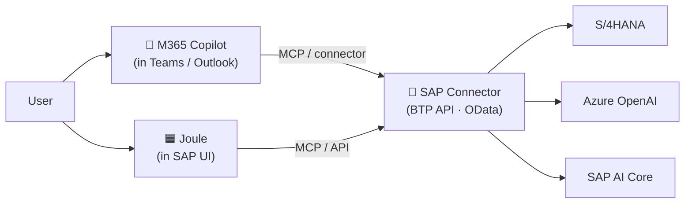

# 🟦 Track C — SAP + Azure Professional

> Goal: combine **SAP domain depth** with **Azure AI muscle**. Build Joule + Azure OpenAI scenarios that win deals or unblock customers.

## Profile

You're an SAP architect, BTP developer, or Microsoft seller covering SAP accounts. You need to fluently discuss **Joule, AI Core, Azure OpenAI on BTP, Copilot for SAP, and Joule + Copilot interop**.

## Why SAP + Azure together?

- SAP runs the **system of record** (S/4HANA, Ariba, SuccessFactors)
- Azure runs the **AI brain** (Azure OpenAI, Foundry, Purview)
- **Joule** is the agent layer that bridges them
- 70% of SAP customers run their SAP estate on Azure

## 4–5 month plan

### Month 1 · Joule fundamentals
- ✅ **OpenSAP — Generative AI at SAP** (free MOOC)
- ✅ **Joule overview videos** on SAP News
- ✅ Hands-on with **Joule for end users** (S/4HANA Cloud trial)
- 📖 Read the **SAP AI Strategy** white paper
- 🎯 Side cert: **AI-901** to anchor the Azure side

### Month 2 · SAP AI Core + AI Launchpad
- ✅ **SAP AI Core fundamentals** (SAP Learning Hub)
- ✅ **AI Launchpad walkthrough**
- ✅ Deploy a sample model on AI Core (transformer, OpenAI proxy, custom LoRA)
- 🛠️ **Reference build:** call Azure OpenAI from BTP via Generative AI Hub

### Month 3 · Joule Studio + agents
- ✅ **Joule Studio walkthrough** (low-code agent builder, GA Q1 2026)
- ✅ Build a custom **Joule agent** combining SAP-native skills + an external API (e.g. weather, finance data)
- 🛠️ **Reference build:** Invoice-dispute-resolution-style agent
- 📚 Study **Joule Skills SDK** + **MCP support roadmap** (SAP Commerce MCP server)

### Month 4 · Azure OpenAI + Copilot for SAP
- ✅ **Microsoft Copilot for SAP scenarios** — sales, finance, HR
- ✅ **Azure OpenAI on SAP BTP** reference architecture
- ✅ **Microsoft Fabric + SAP Datasphere** integration patterns
- 🛠️ **Reference build:** Copilot in Teams that pulls SAP data via OData → Azure OpenAI for narrative

### Month 5 · Cross-cutting concerns
- 🛡️ **Identity:** SAP Cloud Identity + Entra federation
- 🛡️ **Data residency:** EU sovereign clouds, Azure EU Data Boundary
- 🛡️ **Compliance:** ISO 27001, ISO 42001, EU AI Act for financial / regulated workloads
- 💰 **Cost:** PTU on Azure OpenAI vs. Joule's bundled inference

## Killer demo scenario (replicate this)

> "An accounts-payable analyst in S/4HANA receives a flagged invoice. Joule recognizes the dispute pattern, calls a Joule Studio agent that (a) fetches purchase order data from S/4HANA, (b) calls Azure OpenAI for narrative reasoning, (c) drafts a vendor-facing email, (d) opens a follow-up workflow in SuccessFactors. Resolution drops from 150 minutes to 30 minutes."

## Joule + Copilot interop pattern

## Reading + watching list

- [SAP Joule overview](https://www.sap.com/products/artificial-intelligence/ai-assistant.html)
- [SAP Generative AI Hub on BTP](https://help.sap.com/docs/ai-core/generative-ai-hub/)
- [Microsoft + SAP partnership announcements](https://news.microsoft.com/source/topics/sap/)
- [SAP Sapphire AI keynotes](https://news.sap.com/topics/sapphire/)
- [Microsoft Mechanics — SAP on Azure](https://www.youtube.com/@MSFTMechanics)

## Useful certs combo

| You should hold | Why |
|---|---|
| Microsoft AI-901 + AZ-305 | Azure AI + architect credibility |
| SAP Certified Associate — SAP AI | SAP-side credibility |
| SAP Certified — BTP Extensibility | For Joule Studio depth |
| ISO/IEC 42001 lead implementer (optional) | Regulated industries |

← [Back to README](../../README.md)
